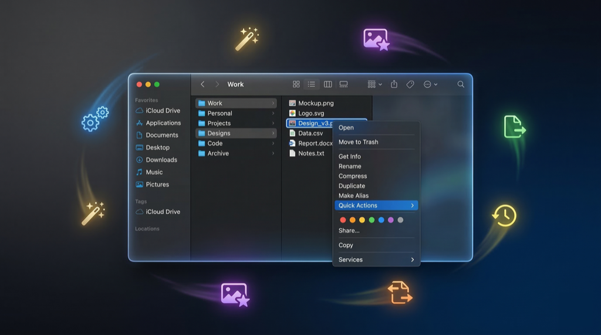

# macOS Workflows

<p align="center">
  
</p>

[](https://opensource.org/licenses/MIT)
[](https://www.apple.com/macos/)
[](https://support.apple.com/guide/automator/)
[](https://swift.org/)
[](https://www.python.org/)
[](http://makeapullrequest.com)
[](https://github.com/pepperonas/macos-workflows)
[](https://github.com/pepperonas/macos-workflows/issues)
[](https://github.com/pepperonas/macos-workflows/commits/main)
[](https://github.com/pepperonas/macos-workflows)

A collection of useful macOS Finder Quick Actions (Automator workflows) and utility scripts that are easy to install and use.

## Available Workflows

| Workflow | Description | Requirements |
|----------|-------------|--------------|
| [Remove Nano Banana Watermark](workflows/remove-nano-banana-watermark/) | Removes the sparkle watermark from Nano Banana AI-generated images | Python 3, Pillow |
| [Remove Background](workflows/remove-background/) | Removes the background from images, keeping only the main subject with transparency | macOS 14+, Xcode CLI Tools |
| [Resize to w1024px](workflows/resize-to-w1024px/) | Resizes images to 1024px width, keeping aspect ratio. Skips smaller images | None (built-in `sips`) |
| [WhatsApp Line Wrap](workflows/whatsapp-line-wrap/) | Wraps selected text to 40-char lines for WhatsApp readability. Converts ASCII tables to card format. Result copied to clipboard | Python 3 |
| [Remove Vowels](workflows/remove-vowels/) | Removes all vowels (incl. German umlauts äöü) from selected text. Result copied to clipboard | None (built-in `tr`) |

## Utility Scripts

| Script | Description | Requirements |
|--------|-------------|--------------|
| [Cleanup Caches](workflows/cleanup-caches/) | Frees disk space by clearing macOS/npm/Gradle caches and flushing PM2 logs | None |

## Quick Install

1. Clone the repo or download the `.workflow` you need
2. Double-click the `.workflow` file
3. Click **Install** when prompted
4. Enable under **System Settings > General > Login Items & Extensions > Finder**

```bash
git clone https://github.com/pepperonas/macos-workflows.git
open "macos-workflows/workflows/remove-nano-banana-watermark/Remove Nano Banana Watermark.workflow"
```

## Usage

- **Image workflows:** Right-click any file in Finder → **Quick Actions** → select the workflow.
- **Text workflows:** Select text in any app → right-click → **Services** → select the workflow. The result is copied to your clipboard.

## Contributing

Have a useful workflow? PRs are welcome! Place your workflow in `workflows/<name>/` with:

- `<Name>.workflow/` — the Automator workflow bundle
- `README.md` — description, requirements, and usage

## Author

**Martin Pfeffer** — [celox.io](https://celox.io) — [@pepperonas](https://github.com/pepperonas)

## License

[MIT](LICENSE)
